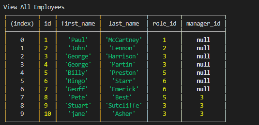
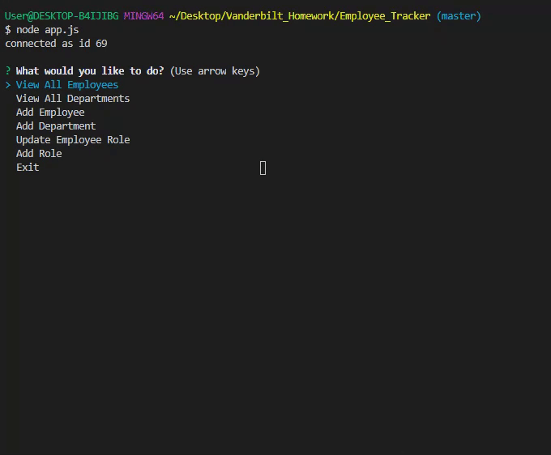

# Employee_Tracker

## Description

Employee Tracker is a command line interface that allows the user to track their employees using Node, MySQL, and inquirer. It allows the user to access their database via the command line. It also allows them to edit and add to the database.

To view a video of the app's full functionality click [here.](https://www.youtube.com/watch?v=MDLIORrwH6c&feature=youtu.be)

## Example Image

## 

## 
